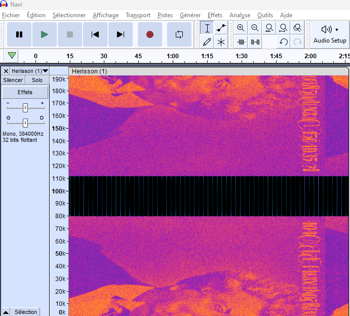

# Avez-vous vu les cascades du hérisson ?

## Description

Après avoir rencontré Simone, cette dernière vous propose de découvrir une nouvelle personne. Quoi de mieux qu’un cache-cache pour apprendre à mieux se connaître ? Cela vous changera de l'air du café littéraire Le Procope.

Vous arrivez dans un lieu qui lui est cher, un lieu d’enfance rempli de souvenirs. C’est ici qu’elle passait ces vacances d’Été, dans le parc de Meyrignac, fondé en 1880 par son grand père Ernest BERTRAND DE BEAUVOIR.

Lors de votre partie, non loin de là, vous parvenez habilement à trouver Simone, cependant le troisième joueur demeure parfaitement introuvable. Votre cerveau titanesque a eu la bonne idée de faire ce jeu dehors, en pleine nature, pour plus de difficulté. Sublime. Vous voilà errant au milieu de nulle part. Toutefois, un bruit vous attire :

« SPLASHHHH... SHHHHH... SPLASHHHH... SHHHHH... » (Le son d'une cascade d'eau qui tombe et qui ruisselle)

Cette chute d'eau paraît ordinaire et suspicieuse. Peut-être parviendrez-vous à trouver ce charmant flibustier à travers les cascades du Hérisson avant qu'il soit l'heure de rentrer au Procope ?

---

Vous avez un oeil de lynx, ainsi vous apercevez que la chute d'eau s'écoule à une fréquence de 2 MHz

Format du flag : 404CTF{ceci_est_un_flag}

## Solution

On télécharge le fichier `.raw`. Après une rapide première écoute on se rend compte que l'on entends que du bruit. En cherchant un peu, on trouve différent challenges de Radio-Fréquences qui utilise les spectrogrammes. On utilise donc `Audacity` pour obtenir le spectre de la fréquence.

On aperçoit le flag écrit ! Cependant, il est comme bruité la partie basse du spectre se duplique de manière symétrique sur la partie haute et inversement. On convertit donc le fichier de `.raw` à `.wav` en utilisant l'utilitaire `sox`. `sox -r 2000000 -e float -b 32 -c 1 -t raw Herisson.raw Herisson.wav`. Une fois ce fichier obtenu, nous l'ouvrons dans `Sonic Visualiser` afin d'appliquer des filtres sur l'image pour obtenir le flag.

Le flag est difficile à lire, il ne faut conserver que les lettres dans le bon sens car comme vu précédemment, il y a du bruit. Les lettres du milieu sont les plus hardues à lire mais en tatonant un peu, nous réussissons à flag le challenge.

## Flag : `404CTF{413X4NDR3_D4N5_UN3_C45C4D35_?}`
