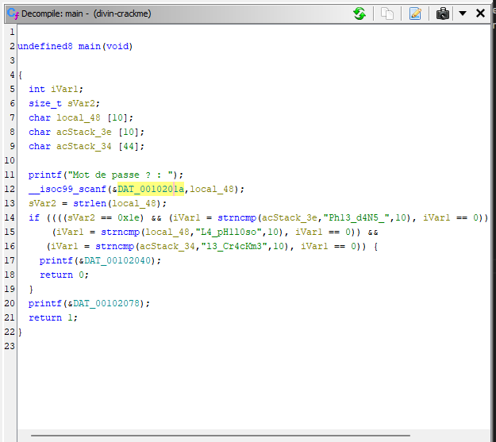
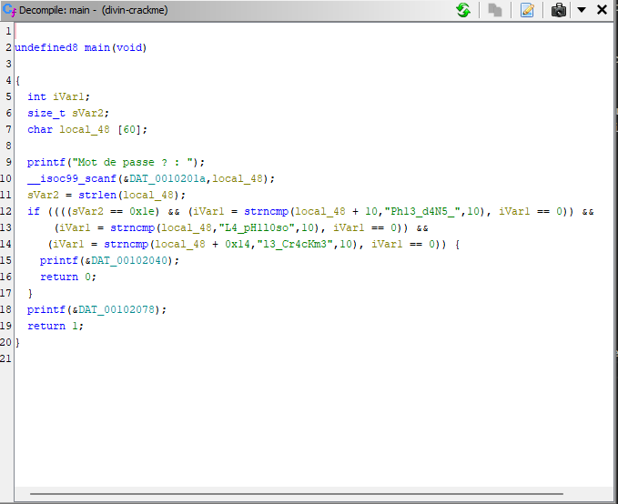

# Le Divin Crackme

## Description

Jean-Jacques Rousseau vous prend à part : « J'ai déjà raconté la fois où j'ai rencontré le Marquis de Sade ? Non ? Tu en as de la chance... Mes amis avaient plannifié une entrevue entre lui et moi en ville. Avant même de lui parler, il me paraissait étrange. Quoique l'air bien à l'aise, les premiers mots qu'il prononça furent 'Me feriez vous le plaisir de jouer en ma compagnie ?'. Malgré sa demande, j'avais comme l'impression de ne pas vraiment avoir le choix et, en effet, avant de pouvoir lui répondre il poursuivit 'Voici ce que nous allons entreprendre : Vous trouvez mon mot de passe et vous voilà libre. Autrement, je ne réponds plus de rien.'.

Tandis que je m'essayais à son drôle jeu, il me présentait ses points de vue sur les institutions, et, bien que je partage ses opinions sur la nécessité d'accepter l'humain le plus naturel, laissant la corruption des mœurs installée par les institutions derrière nous, je restais critique face à ses aspects les plus libertins... »

« Il serait malvenu de te raconter ce qui se passa par la suite considérant mon échec, mais je suis curieux, aurait tu réussi, toi ? Essaye donc, tu ne risques rien en ce qu'il te concerne ! Pour vérifier que tu ne m'as pas répondu au hasard, j'aimerais que tu me précises avec quel programme le binaire a été compilé ainsi que la fonction spécifique qui est utilisée pour tester le mot de passe. »

---

Format : 404CTF{compilateur:fonction:mot_de_passe} | tout en minuscules sauf le mot de passe

## Solution

Nous récupérons le fichier binaire fourni et nous l'analysons à l'aide de `ghidra`.

On se rend compte que le programme récupère 60 caractères en entrée on réécrit donc la variable `local_48` pour qu'elle contienne 60 caractères maximum.

On voit que le programme compare la variable `local_48` avec le mot de passe `L4_pH1l0soPh13_d4N5_l3_Cr4cKm3`.

Le compilateur utilisé est gcc car il s'agit d'un fichier ELF 32 bits.
Le mot de passe est `L4_pH1l0soPh13_d4N5_l3_Cr4cKm3`.
et la fonction utilisée est `strncmp`.

## Flag : `404CTF{gcc:L4_pH1l0soPh13_d4N5_l3_Cr4cKm3:strncmp}`
