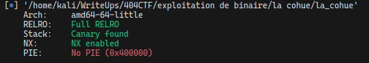
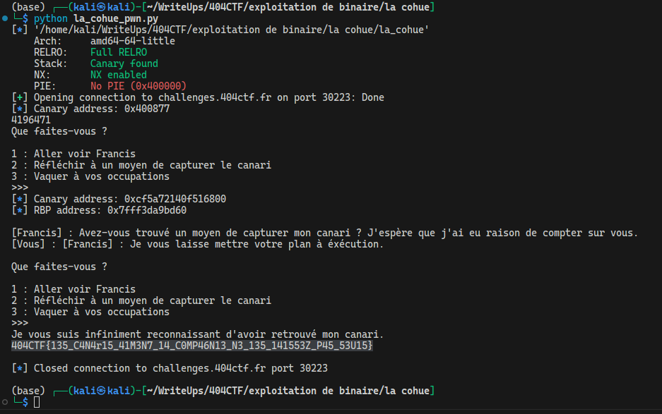

# La cohue

## Description

Le café littéraire est plongé dans une agitation frénétique. Un petit boule jaune virevolte dans tous les sens, semant la panique parmi les clients. Au milieu du chaos, une silhouette se détache, immobile et imperturbable : c'est Francis Jammes. Vous vous frayez difficilement un chemin à travers la foule jusqu'à lui. Il vous explique alors qu'il vient d'adopter un canari un peu excentrique, qui s'est échappé de sa cage et qui semble avoir élu domicile dans le café. Francis vous lance un regard légèrement inquiet et vous demande si vous pourriez l'aider à retrouver son volatile farceur. Alors que vous vous apprêtiez à partir, James vous murmure à l'oreille : « Sachez que parfois, un canari peut en cacher un autre » .

Que décidez-vous de faire ?

---

Toutes les informations nécéssaires à la résolution de ce challenge sont présentes après s'être connecté en netcat.

nc challenges.404ctf.fr 30223

## Solution

Un fichier binaire nous est fourni. En l'analysant sur ghidra, on obtient plusieurs informations. Lors de l'exécution, nous arrivons dans une boucle while dans la fonction choices. Nous avons ici 3 choix, dans le premier un stack buffer overflow car la fonction `gets` est utilisée. Dans le deuxième choix, nous avons un format string vulnérable car la fonction `printf` est utilisée sans formatage particulier. Le dernier choix est un choix de sortie du programme. Nous nous rendons compte qu'une fonction `canary` existe et qu'elle nous donne le flag. En analysant les sécurités activées sur le binaire, nous nous rendons compte que la stack est protégé par un Canary.

Le plan d'action est donc clair, dans un premier temps, exploiter le string format pour obtenir la valeur du canary (Nous savons que les canary sur linux finissent par 0x00). Ensuite, nous pourrons exploiter le buffer overflow pour écraser le canary et ainsi passer la vérification. Enfin, nous pourrons appeler la fonction `canary` pour obtenir le flag. Le script `la_cohue_pwn.py` permet de réaliser cette exploitation.

## Flag : `404CTF{135_C4N4r15_41M3N7_14_C0MP46N13_N3_135_141553Z_P45_53U15}`
