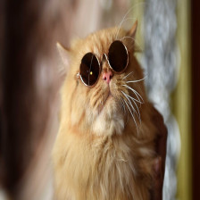
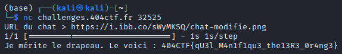

# Le Petit Chat

## Description

Ebloui par les reflets du soleil sur l'imposante vitrine du café littéraire lors d'une éclaircie, vous plissez les yeux et marquez un temps d'arrêt. Une boule dorée attire votre attention. Tiens, ce n'est pas une boule, mais un petit chat orange, le regard absorbé par la vitrine luisante. Vous vous étonnez de remarquer des lunettes de soleil surplombant ses magnifiques moustaches blanches, il semble étrangement équipé en cette pluvieuse journée. Par curisosité, vous sortez du café et vous vous approchez discrètement, ayant senti votre mouvement, le chat se retourna.

« Vous ne seriez pas Hackademicien par hasard, dit-il, d'un air effrayé.

— Non pourquoi ?

Soulagé, le petit chat se retourna complètement, se leva de tout son long sur ses deux pattes arrières, frotta ses griffes sur son pelage et vous tendit la patte.

— Je suis le Chat botté ! Ravi de faire votre connaissance !

N'étant pas plus surpris de voir un chat qui parle qu'un chat avec des lunettes languissant devant un café littéraire, vous décidez de tendre votre main à votre tour.

— Mon maître, Monsieur le Marquis de Carabas m'attend dans ce café, malheureusement, je ne peux pas le rejoindre, les chiens sont interdits.

— Et alors ? Vous êtes un chat, vous devriez pouvoir entrer.

— Justement, je suis censé pouvoir rentrer, mais l'intelligence artificielle qui garde l'entrée se mélange les neurones ! Voilà qu'elle confond les chiens et les chats.

— C'est très dérangeant.

— À cause de ce dysfonctionnement, je me retrouve dehors, dit-il, en levant ses lunettes et en vous regardant intensément avec ses gros yeux noirs et son aura envoûtante.

— Vous allez m'aider, n'est-ce pas ?

Ne sachant que répondre face à cette claire injustice, vous décidez seulement d'acquiescer de la tête. Satisfait, le chat s'approcha et vous proposa à voix basse :

— Vous vous y connaissez dans l'art du camouflage ? Oui ? Excellent, c'est exactement ce qu'il me faut. J'ai entendu dire que le thé était très apprécié dans cet endroit, pouvez-vous m'aider à me faire passer pour une théière ? Cela me permettrait de rejoindre mon maître ! »

Ne pouvant plus faire demi-tour, vous prenez une profonde respiration pour vous concentrer sur votre objectif : transformer ce petit chat roux en théière !

---

Pour valider le challenge, il faudra upload votre image de chat modifié sur internet et récupérer son URL. Enfin, il vous suffira de vous connecter via netcat et d'entrer l'URL du chat modifié. Voici un site possible : https://imgtr.ee/. L'image originale est téléchargeable ci-dessous : chat.jpg.

Vous pouvez vous aider du script verificateur.py afin d'avoir le modèle utilisé et de pouvoir essayer en local. Attention ! Ne ~modifiez~~ pas trop le petit chat, il faut que son maître puisse le reconnaître.

Un peu de lecture pour trouver l'inspiration : http://clpav.fr/lecture-chat-botte.htm. (Ne sert à rien pour résoudre le challenge)

nc challenges.404ctf.fr 32525

## Solution

En inspectant un peu les sources qu'on a, on se rend compte qu'on a une image de chat et un script python qui permet de vérifier si on a bien modifié le chat en théière sans que cela soit trop flagrant. Cette description nous fait donc penser à des attaques adversariales. Il existe de nombreux répertoires sur github qui permettent de faire des attaques adversariales, on va se concentrer sur CleverHans qui permet de réaliser des attaques adversariales sur des modèles tensorflow.

Dans un premier temps, il faut comprendre comment est préparée l'image en entrée pour inverser le processus et récupérer l'image originale. Les transformations sont dans l'ordre :

- On cast l'image de uint8 à float32
- On redimensionne l'image à 224x224
- On soustrait à chaque pixel mean = [103.939, 116.779, 123.68]
- On ajoute une dimension

Une fois ce processus compris, on lance notre attaque grâce à la méthode `basic_iterative_method` de cleverhans (https://arxiv.org/pdf/1607.02533.pdf) en mode targeted. L'algorithme va donc ajouter du bruit à l'image de chat de manière itérative pour que le modèle prédise que c'est une théière. En jouant un peu avec les paramètres, nous arrivons rapidement à un résultat concluant :  
chat original :

chat modifié :

Il nous suffit de l'uploader sur un site d'hébergement d'image et de rentrer l'url dans le netcat pour valider le challenge.  
Le script python utilisé pour réaliser l'attaque et la vérification est disponible dans le fichier `solve.py`.  

## Flag : `404CTF{qU3l_M4n1f1qu3_the13R3_0r4ng3}`
