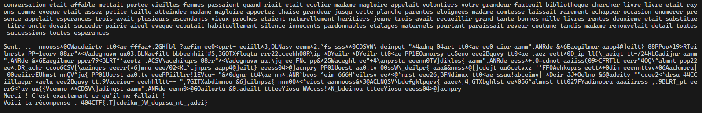

# Des mots, des mots, des mots

## Description

Prenant du bon temps à votre table en lisant un livre, vous buvez une gorgée de café. En baissant votre tasse, vous remarquez à travers la fenêtre une petite silhouette, elle semble chercher quelque chose ou quelqu'un.

Cette intrigante situation vous pousse à aller à sa rencontre. La silhouette est en réalité une jeune fille rousse. Vos regards se croisent, elle a l'air perdue. Vous la rejoignez, et lui demandez :

« Bonjour, puis-je t'aider ?
— Oui. Je cherche à traduire un texte selon des règles étranges mot à mot. Il s'agit d'un livre nommé Les Misérables. Peux-tu m'aider ? Au fait, moi c'est Cosette !
— Je vois, aucun problème. Je peux justement te faire un script qui va transformer chaque mot de ton texte. Quelles sont ces règles ?
— Je vais tout t'expliquer, allons nous installer à l'intérieur.»

Elle vous suit à votre table et vous vous mettez au travail.

---

Indications :

Les voyelles sont {a, e, i, o, u, y}.
L'indiçage commence à 0.
Les règles sont données en Markdown. Les \_ dans les exemples sont des balises italique Markdown et ne comptent pas dans l'exemple.
Les règles sont à appliquer les une après les autres. Typiquement pour la règle 2 il faut partir du résultat de la règle 1, et ainsi de suite.
Le symbole ^ correspond à l'opérateur puissance.

nc challenges.404ctf.fr 30980

## Solution

En nous connectant au netcat, on nous donne la première règle (on ne parlera pas de la première règle qui ne fait rien):

Règle 1 : Inverser les lettres

On l'implètement très facilement en python :

```python
def regle_1(entry):
    return entry[::-1]
```

Règle 2 :

- Si le mot à un nombre de lettres pair, échanger la 1ere et la 2e partie du mot obtenu
- Sinon, enlever toutes les lettres du mot correspondant à la lettre centrale

```python
def regle_2(entry):
    if len(entry) % 2 == 0:
        return entry[len(entry) // 2 :] + entry[: len(entry) // 2]
    else:
        middle_letter = entry[len(entry) // 2]
        return entry.replace(middle_letter, "")
```

Règle 3 :
_Si le mot a 3 lettres ou plus_ :

- Si la 3e lettre du mot obtenu est une consonne, "décaler" les voyelles vers la gauche dans le mot original, puis réappliquer les règles 1 et 2.
- Sinon : la même chose mais les décaler vers la droite.

> Ex de décalage : _poteau => petauo_ // _drapeau => drupaea_

```python

voyelles = "aeiouyAEIOUY"
consonnes = "bcdfghjklmnpqrstvwxzBCDFGHJKLMNPQRSTVWXZ"

def regle_3(entry, initial_entry):
    new_entry = initial_entry
    if len(entry) >= 3 and entry[2] in consonnes:
        new_entry = shift_vowels_left(initial_entry)
        new_entry1 = regle_1(new_entry)
        new_entry2 = regle_2(new_entry1)
        new_entry = new_entry2
    else:
        new_entry = shift_vowels_right(initial_entry)
        new_entry1 = regle_1(new_entry)
        new_entry2 = regle_2(new_entry1)
        new_entry = new_entry2

    return new_entry

def shift_vowels_left(entry):
    voy_index = []
    list_entry = list(entry)
    for ind, char in enumerate(entry):
        if char in voyelles:
            voy_index.append(ind)
    if len(voy_index) == 0:
        return entry
    first_voy = list_entry[voy_index[0]]
    for ind in range(len(voy_index) - 1):
        list_entry[voy_index[ind]] = list_entry[voy_index[ind + 1]]
    list_entry[voy_index[-1]] = first_voy
    return "".join(list_entry)


def shift_vowels_right(entry):
    voy_index = []
    list_entry = list(entry)
    for ind, char in enumerate(entry):
        if char in voyelles:
            voy_index.append(ind)

    if len(voy_index) == 0:
        return entry

    last_voy = list_entry[voy_index[-1]]
    for ind in range(len(voy_index) - 2, -1, -1):
        list_entry[voy_index[ind + 1]] = list_entry[voy_index[ind]]
    list_entry[voy_index[0]] = last_voy
    return "".join(list_entry)
```

Et finalement, la règle 4:

Règle 4 :

- Pour `n` allant de 0 à la fin du mot, si le caractère `c` à la position `n` du mot est une consonne (majuscule ou minuscule), insérer en position `n+1` le caractère de code ASCII `a = ((vp + s) % 95) + 32`, où `vp` est le code ASCII de la voyelle précédant la consonne `c` dans l'alphabet (si `c = 'F'`, `vp = 'E'`), et `s = SOMME{i=n-1 -> 0}(a{i}*2^(n-i)*Id(l{i} est une voyelle))`, où `a{i}` est le code ASCII de la `i`-ième lettre du mot, `Id(x)` vaut `1` si `x` est vrai, `0` sinon, et `l{i}` la `i`-ième lettre du mot. _Attention à bien appliquer cette règle aussi sur les caractères insérés au mot._

> Ex : _futur => f&ut\ur@_

- Enfin, trier le mot par ordre décroissant d'occurrences des caractères, puis par ordre croissant en code ASCII pour les égalités

> Ex de tri : _patate => aattep_

```python

voyelles = "aeiouyAEIOUY"
consonnes = "bcdfghjklmnpqrstvwxzBCDFGHJKLMNPQRSTVWXZ"

def get_prec_voy(char):
    if char in voyelles:
        return char
    else:
        return get_prec_voy(chr(ord(char) - 1))


def regle_4(entry):
    list_entry = list(entry)
    entry1 = insert_new_chars(list_entry)
    entry2 = sort_regle_4(entry1)

    return entry2


def sort_regle_4(entry):
    new_dict = {}
    for char in entry:
        if char in new_dict:
            new_dict[char] += 1
        else:
            new_dict[char] = 1

    new_dict = sorted(new_dict.items(), key=lambda x: ord(x[0]))
    new_list = sorted(new_dict, key=lambda x: x[1], reverse=True)

    new_entry = ""
    for element in new_list:
        new_entry += element[0] * element[1]

    return new_entry


def insert_new_chars(list_entry):
    j = 0
    while True:
        for n in range(j, len(list_entry)):
            if list_entry[n] in consonnes:
                vp = ord(get_prec_voy(list_entry[n]))
                s = 0
                for i in range(n - 1, -1, -1):
                    s += (
                        ord(list_entry[i]) * pow(2, n - i) * (list_entry[i] in voyelles)
                    )
                a = ((vp + s) % 95) + 32
                list_entry.insert(n + 1, chr(a))
                j = n + 1
                break
        else:
            break
    return "".join(list_entry)
```

Une fois toutes les règles implémentées, il suffit de les appliquer dans l'ordre sur chaque mot donné pour obtenir le drapeau.



Le script complet est disponible dans le fichier `solve.py`

## Flag : `404CTF{:T]cdeikm_)W_doprsu_nt_;adei}`
