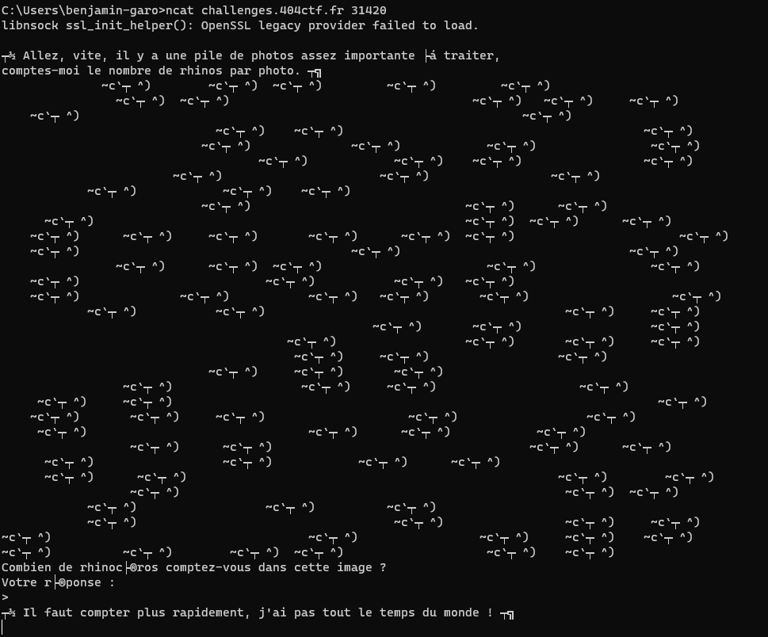

# L'inondation

## Description

Vous prenez une collation accolé au bar du Procope, et remarquez au bout d'une dizaine de minutes un post-it, sur lequel votre nom est écrit, et en dessous une inscription : « Salut, le nouveau, viens à ma rencontre, porte de derrière ».
Curieux, vous sortez du café par cette porte et tombez nez à nez avec un jeune homme.

« Bonjour, pouquoi ce post-it ?

— Salut ! Excellente question. Dernièrement, un évènement étrange a bouleversé ma ville : elle a été prise d'une épidémie de gens se transformant en rhinocéros. Alors que ce n'était jusqu'hier qu'une dizaine de gens qui étaient touchés, j'ai vu ce matin un troupeau de ce qui semblait être plusieurs centaines de rhinocéros passer sous ma fenêtre. J'ai aussitôt saisi mon appareil photo et photographié régulièrement le troupeau pour avoir une estimation du nombre de rhinocéros, mais il y en a bien trop pour compter tout ça à moi seul ou même à deux.

— Certes, et où voulez-vous donc en venir ?

— Voyez-vous, j'ai entendu parler de vos talent dans les nouvelles technologies par le biais d'un ami qui fréquente ce café. J'imagine qu'un ordinateur saura compter bien plus vite que nous deux, ça vous dirait de m'aider ? D'ailleurs, on ne s'est toujours pas présentés. Moi, c'est Béranger. »

---

nc challenges.404ctf.fr 31420

## Solution

En nous connectant au serveur, on nous demande de compter le nombre de rhinocéros.

Pour se faire, nous allons créer un script python qui se connecte au serveur, récupère les informations, compte le nombre de rhinocéros et envoie la réponse. Après avoir envoyé la première réponse, nous voyons que nous devons répondre un nombre indéfini de fois, nous imbriquons donc le tout dans une boucle `while True` avec une sortie lors de la réception du flag. La solution se trouve dans le fichier `solve.py`

## Flag : `404CTF{4h,_l3s_P0uvo1rs_d3_l'iNforM4tiqu3!}`
