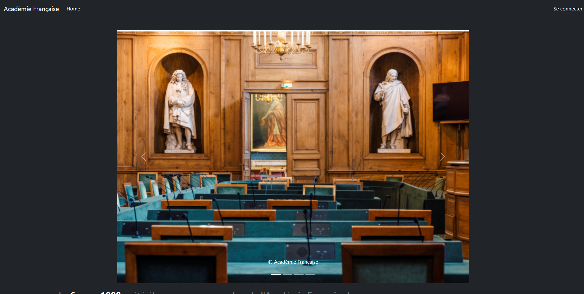
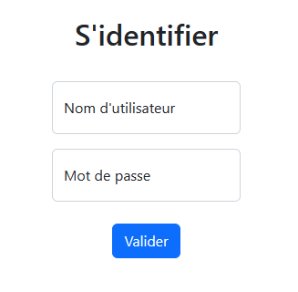
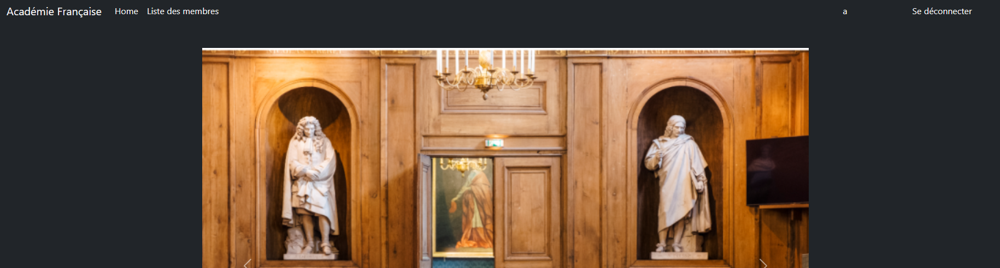
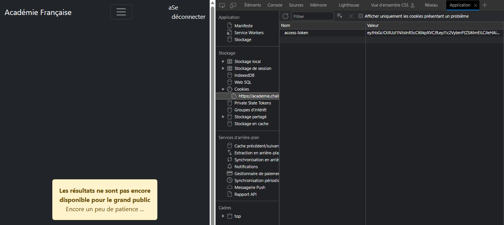
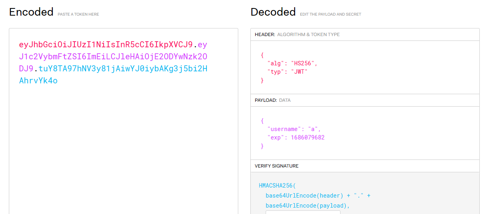
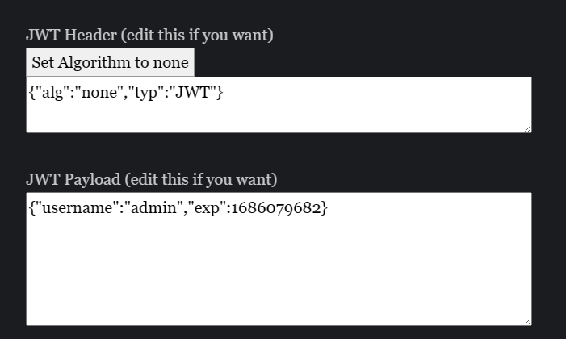
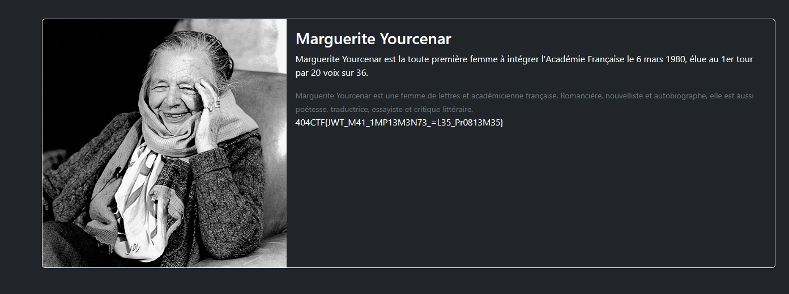
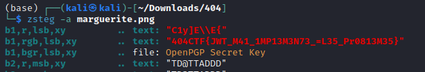

# L'Académie du détail

## Description

Le nez plongé dans votre café noir, vous parcourez d'un rapide coup d'œil la une du journal fraichement paru. L'un des titres vous interpelle :

Mars 1980 : L'opaque secret du nouveau membre de l'Académie Française.
Vous parcourez alors le journal à la recherche de l'article en question. Il énonce :

Après des heures de délibération, les Académiciens ont enfin voté pour le nouveau membre de la grande Académie Française. Mais pour des raisons que tout le monde ignore, son nom demeure secret depuis ce jour. Malgré tous leurs efforts, aucun journaliste n'a réussi a obtenir le moindre indice ou la moindre image.
Interloqué, vous vous rendez compte que l'Académie Française possède un site web. Peut être que la réponse est finalement à portée de tous, voir même plus ... !

---

Toutes les informations nécéssaires à la résolution de ce challenge sont présentes dans l'énoncé ci-dessus.

Le flag est au format classique 404CTF{}. Vous devez le trouver, il ne peut pas être deviné.

https://academie.challenges.404ctf.fr/

## Solution

En cliquant sur le lien, nous arrivons sur une page d'accueil aux couleurs de l'académie Française avec un bouton `Se connecter` en haut à droite.  

Nous cliquons sur ce bouton et arrivons sur une page d'authentification.  

En essayant un utilisateur aléatoire avec un mot de passe aléatoire lui aussi, nous nous rendons compte que nous sommes connectés.  

Nous voyons un nouveau bouton `Liste des membres`, en essayant d'y accéder, nous arrivons sur une page d'erreur.  

En inspectant les cookies, nous nous rendons compte qu'il y a un cookie jwt. Nous allons donc le décoder avec un site en ligne.  

Essayons de devenir admin pour voir si nous avons accès à la page `Liste des membres`. Nous allons donc modifier le cookie jwt pour avoir le rôle admin en changeant l'algorithme de vérification `HS256` en `none`. Site utilisé : https://jwt.io/ et https://www.gavinjl.me/edit-jwt-online-alg-none/  

Nous modifions donc le cookie en conséquence et rafraichissons la page. Nous arrivons sur la page `Liste des membres` et voyons le flag.  

Dans une ancienne version, le flag était caché dans l'image à l'aide d'un lsb. En utilisant zsteg, nous obtenons le flag :  

## Flag : `404CTF{JWT_M41_1MP13M3N73_=L35_Pr0813M35}`
