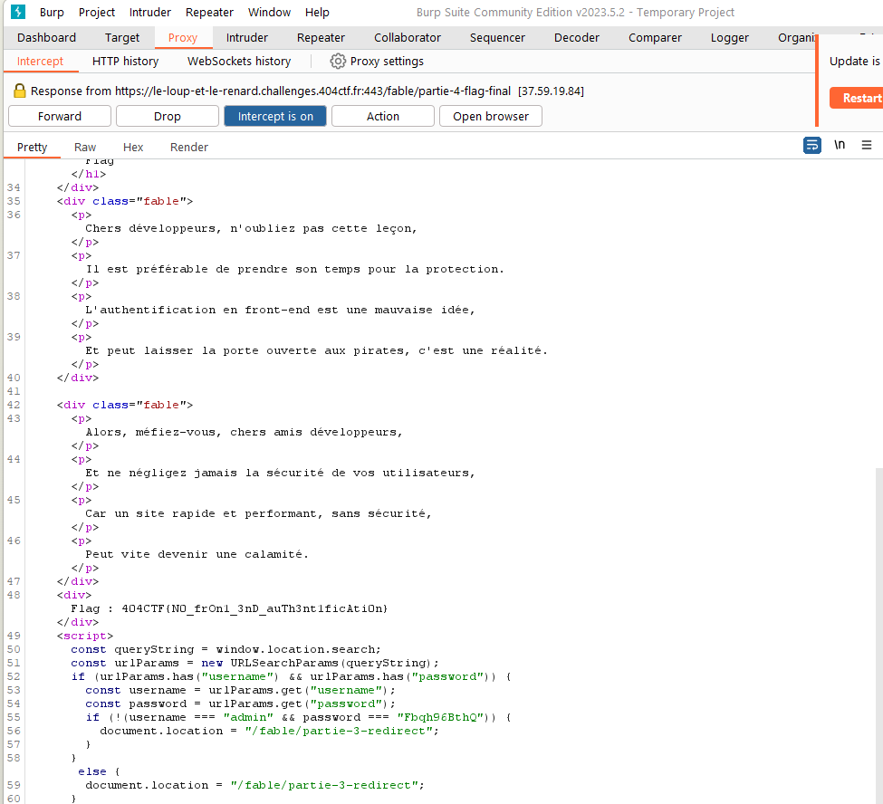

# Le Loup et le renard

## Description

Dans un coin du café, un homme est assis. Une tasse de café ainsi qu'un manuscrit sont posés devant lui. Il observe la salle : les allées-venues des clients, les conversations. Il semble à l'affût de la moindre action, du moindre écart de la part de son sujet d'observation.

Alors que son regard parcourt la salle, il s'étonne de voir que vous l'observiez déjà. D'un geste accompagné d'un sourire il vous invite à le rejoindre.

« Bienvenue ! Prenez place. Il est rare de voir quelqu'un d'attentif à autre chose que sa propre personne ici. C'est dommage, c'est justement ce qu'il y a de plus intéréssant dans ce genre de rassemblement : les autres. Je me présente : Jean de La Fontaine. Votre regard me plait, vous me semblez capable de m'aider sur mon prochain manuscrit. J'écris, voyez-vous ? Des fables, je m'inspire de ce que je vois et j'observe. Pouvez-vous m'aider à écrire la suite de celle-ci ? »

---

Ouvrez l'œil et trouvez la fin de cette fable.

https://le-loup-et-le-renard.challenges.404ctf.fr/

## Solution

En cliquant sur le lien nous arrivons sur une page avec un bouton démarrer.  

En cliquant sur ce bouton, nous arrivons sur la première partie du challenge : une authentification. En inspectant un peu le code source de la page, nous voyons que les identifiants sont stockés dans écrits en clair, nous les récupérons donc et arrivons à la partie suivante. Il est même possible de juste accéder à la partie suivante en copiant le lien de la page suivante.  

Nous arrivons sur une nouvelle page intitulée Cookies, nous allons donc inspecter les cookies de la page. Nous voyons qu'il y a un cookie nommé `isAdmin` qui est à `false`. Nous allons donc le modifier à `true` et rafraichir la page.  

Ce rafraichissement nous emmène à une troisième partie Redirect. Le nom de la page nous laisse penser qu'il s'agit d'une redirection automatique. En inspectant le code source, nous nous rendons compte que le lien vers la partie finale est écrit. Nous ouvrons donc la page dans Burp et interceptons la requête réponse (penser à modifier les settings).  

Nous lisons le flag dans la réponse.

## Flag : `404CTF{N0_frOn1_3nD_auTh3nt1ficAti0n}`
