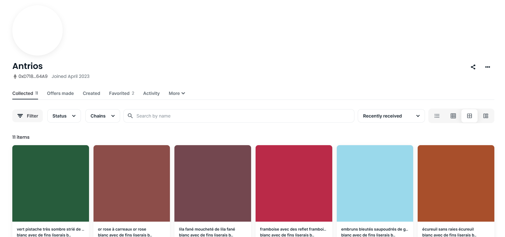
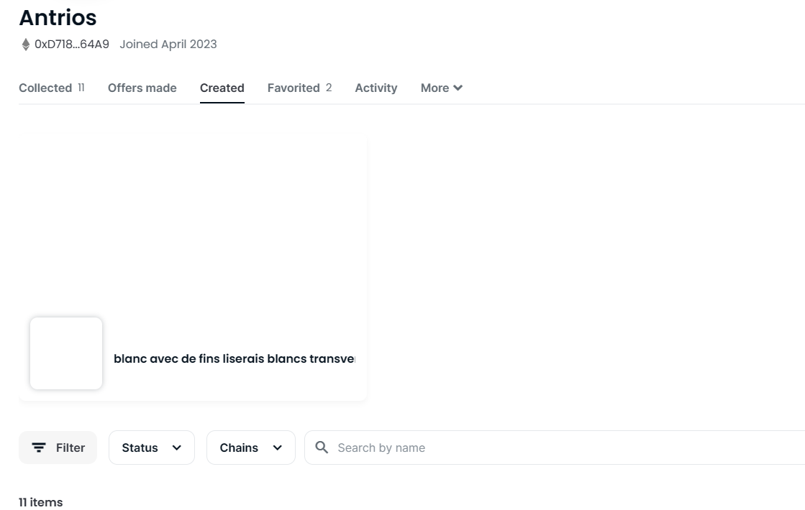

# Art

## Description

Disclaimer : Vous ne devez, en aucun cas, utiliser vos fonds personnels pour résoudre les challenges de web3. Il n'est pas nécessaire de posséder des cryptomonnaies pour lancer les challenges, intéragir avec ou les valider. (Il est aussi inutile de soudoyer les concepteurs des challenges) Cordialement -La trésorerie
Trois hommes sont attablés dans un coin du café. L'un d'eux, Serge, sort une tablette et montre avec beaucoup de fierté sa nouvelle acquisition : un NFT "blanc avec des liserés blancs transversaux". Ses deux amis ne semblent pas convaincus par cet achat :

MARC

Cher ?

SERGE

Deux cent mille.

MARC

Deux cent mille ?...

[...]

SERGE

Mais mon vieux, c'est le prix. C'est un ANTRIOS !

MARC

Tu n'as pas acheté ce tableau deux cent mille francs !

SERGE

J'étais sûr que tu passerais à côté.

MARC

Tu as acheté cette merde deux cent mille francs ?!

---

Qui achèterait une telle œuvre d'art ? Qui VENDRAIT une telle œuvre d'art ?

Trouvez l'adresse Ethereum de l'artiste.

Format : 404CTF{adresse}

## Solution

En lisant la description, on se rend compte que nous devons trouver un NFT d'un certaint `ANTRIOS` qui est blanc avec des liserés blancs transversaux. Pour se faire, nous allons sur Opensea qui est la plus grande plateforme de NFT. On cherche `ANTRIOS` et on trouve un compte qui semble correspondre à l'artiste que nous cherchons.

En allant dans l'ongle `Created`, nous trouvons le NFT que nous cherchons, l'artiste trouvé est donc bien celui recherché.

Nous récupérons dons l'adresse Ethereum de l'artiste : `0xD7186D588Ed2AddF8b260d09B108100f264A64A9`

## Flag : `404CTF{0xD7186D588Ed2AddF8b260d09B108100f264A64A9}`
