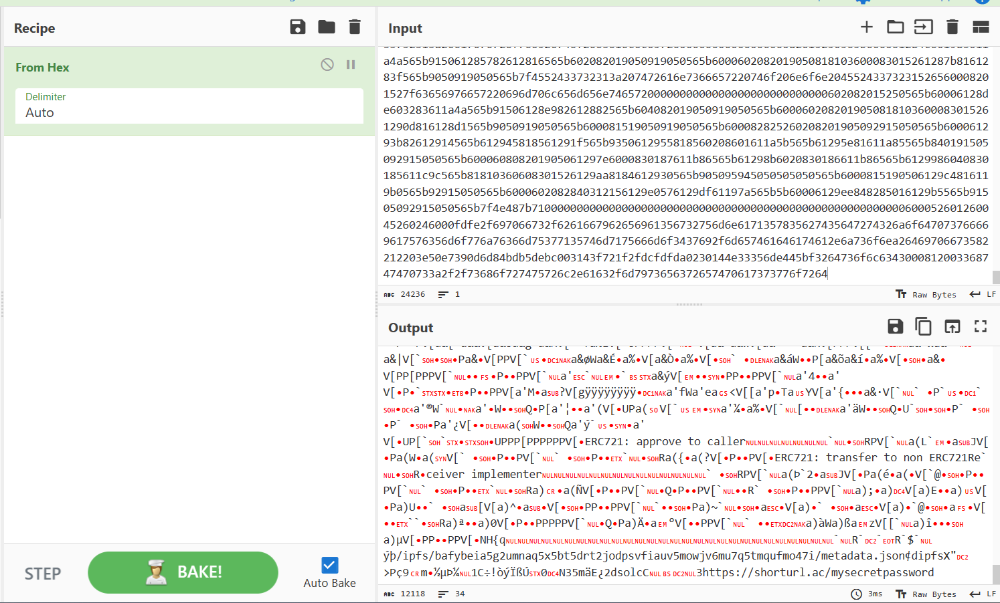
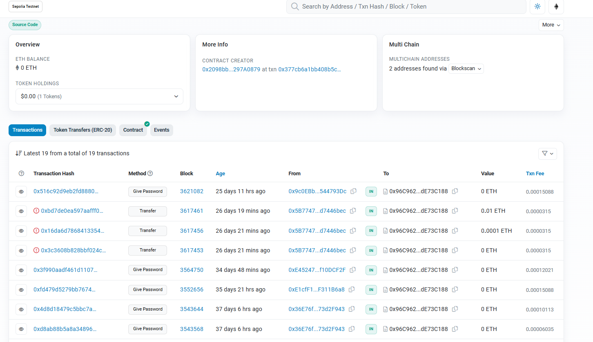
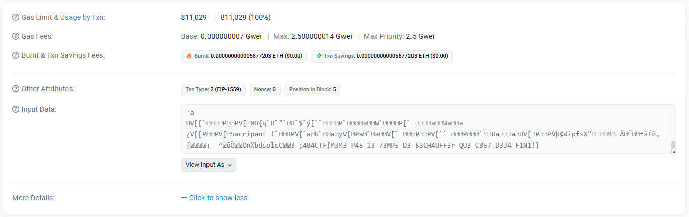

# L'Antiquaire, tête en l'air

## Description

Disclaimer : Vous ne devez, en aucun cas, utiliser vos fonds personnels pour résoudre les challenges de web3. Il n'est pas nécessaire de posséder des cryptomonnaies pour lancer les challenges, intéragir avec ou les valider. (Il est aussi inutile de soudoyer les concepteurs des challenges) Cordialement -La trésorerie
Alors que votre esprit se laissait aller à différentes considérations, une scène étrange capta votre attention. Un vieil homme, agitant frénétiquement ses membres sur une chaise, arborait une expression anxieuse. Emu, vous vous enquîtes de son état, et il se confia à vous, révélant sa profession d'antiquaire et la perte du mot de passe pour accéder à l'un de ses coffres-forts, abritant des antiquités de valeur.

D'un cœur compatissant, vous décidâtes de l'accompagner dans sa boutique pour tenter de retrouver le précieux sésame. Le vieil homme mentionna alors l'existence d'un mémorandum, rédigé il y a de cela quelques années, qui pourrait lui être d'une grande aide en pareille circonstance. Mais, en proie à une certaine confusion, il ne savait plus comment en faire usage. Ainsi vous chargea-t-il de la mission de trouver le mot de passe grâce à ce mémorandum. En guise de remerciement, il vous offrirait la magnifique peau de chagrin ornementant le mur.

---

Que faîtes-vous donc ?

## Solution

Nous récupérons le fichier fourni et nous rendons compte qu'il s'agit d'une longue chaîne hexadécimal. Nous allons donc utiliser CyberChef pour convertir cette chaîne en ASCII.



Nous repérons une url contenant `mysecretpassword`. Il s'agit malheureusement d'un rick roll. En inspectant l'url précédente on voit les caractères `ipfs`. En recherchant un peu, on se rend compte qu'il s'agit d'un protocole permettant de stocker des fichiers sur un réseau décentralisé. Nous cherchons donc sur ipfs.io l'url précisée et nous tombons sur le fichier `json` suivant :

```json
{
  "name": "Le seul et l'unique",
  "description": "Qui sait ce qu'il se cache au bout du chemin ?!",
  "image": "ipfs://bafybeic6ea7qi5ctdp6s6msddd7hwuic3boumwknrirlakftr2yrgnfiga/mystere.png",
  "attributes": [
    {
      "trait_type": "Rarity",
      "value": "Unique"
    }
  ]
}
```

Nous nous rendons donc sur l'url : `https://ipfs.io/ipfs/bafybeic6ea7qi5ctdp6s6msddd7hwuic3boumwknrirlakftr2yrgnfiga/mystere.png`


Nous lisons : `0x96C962235F42C687bC9354eDac6Dfa6EdE73C188`. Nous cherchons l'adresse sur etherscan.io et nous trouvons plusieurs transactions.



Nous inspectons les différentes transcations et en arrivant sur la dernière, nous tombons sur le flag dans le champ `Input Data` :



## Flag : `404CTF{M3M3_P45_13_73MP5_D3_53CH4UFF3r_QU3_C357_D3J4_F1N1!}`
