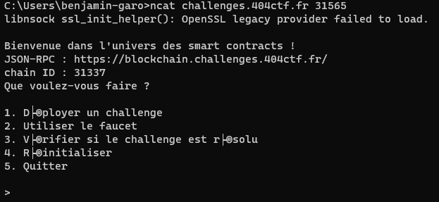

# La Folie du jeu : descente aux enfers

## Description

Disclaimer : Vous ne devez, en aucun cas, utiliser vos fonds personnels pour résoudre les challenges de web3. Il n'est pas nécessaire de posséder des cryptomonnaies pour lancer les challenges, intéragir avec ou les valider. (Il est aussi inutile de soudoyer les concepteurs des challenges) Cordialement -La trésorerie
Narrativement, ce challenge vient avant "La folie du jeu : D'esclave à maître" cependant il n'est pas nécessaire de faire celui-ci pour faire le second. Nous vous conseillons néanmoins de lire l'énoncé de ce challenge pour comprendre le contexte.
Alors que vous étiez assis à une table du café Le Procope, vos pensées furent interrompues par l'apparition de la magnifique Marguerite Gauthier. Son regard était aussi pénétrant que ses courbes gracieuses, et son air empreint d'un charme envoûtant ne laissait aucun doute quant à sa nature exceptionnelle.

Elle s'approcha de vous avec grâce, ses pas silencieux comme une promesse d'aventure. Elle vous confia alors les affres qui tourmentaient son âme : c'était à cause d'elle qu'Armand Duval était pris dans une spirale d'addiction aux jeux d'argent qui le détruisait.

Ce n'était pas n'importe quels jeux d'argent qui retenaient Armand prisonnier de leurs charmes sournois. Non, il s'était épris des loteries établies sur la blockchain Ethereum, ces jeux impitoyables où l'espoir et le désespoir se côtoyaient sans relâche, tels des amants inséparables. Ainsi, les dés étaient jetés, et la danse avec le destin commençait. Vous alliez donc vous plonger dans cet univers énigmatique de la blockchain Ethereum, où les paris étaient éternels et les gains fugaces. Pour Marguerite, vous braveriez les tourments, manipuleriez les nombres et les probabilités avec habileté, cherchant à renverser le cours du destin et à redonner à Armand Duval une chance de s'échapper des griffes implacables du jeu.

Les tasses de café fumaient encore devant vous, tandis que vous vous prépariez à affronter les défis à venir. Marguerite vous observait avec un mélange d'inquiétude et d'espoir dans ses yeux. Vous aviez maintenant un objectif commun : sauver l'âme tourmentée d'Armand et lui offrir une nouvelle vie.

---

Gagnez à la roulette décrite dans le contrat ci-joint :

nc challenges.404ctf.fr 31565

## Solution

Nous récupérons le contrat Solidity et l'ouvrons sur l'Ide Remix. L'ide Remix est une interface permettant de facilement utiliser les contrats Solidity. Nous pouvons y compiler le contrat, le déployer sur une blockchain Ethereum et interagir avec.

Nous pouvons voir que le contrat est très simple, nous devons deviner le prochain nombre générée à l'aide d'une formule mathématique. Seul soucis, nous ne connaissons pas l'état initial. Mais nous sommes dans une blockchain, il est donc facile de récupérer cette information. Un utilitaire telle que `Geth` permet d'explorer cette block chain. Le plan d'action est simple :

- se connecter au netcat
- se créditer des ether à l'aide du faucet
- récupérer l'état initial de la blockchain avec geth
- Deviner le prochain nombre et récupérer le flag

Nous récupérons l'adresse de la blockchain et l'implémentons dans Remix.

Nous déployons le contrat sur la blockchain.

Remix nous propose déjà des adresses de portefeuille à créditer, pas besoin d'en créer un. Nous nous créditons donc de 10 ether.

Une fois notre adresse créditée, nous pouvons intéragir avec le contrat. Nous récupérons l'état initial du contrat avec geth.

- Connexion à la blockchain `geth attach https://blockchain.challenges.404ctf.fr/`.
- Récupération de l'état initial `web3.eth.getStorageAt("0x221B9b8324AF0A0145e581Dbc7070616A0B698d8", 0)`

On récupère la valeur de currentState (qui est la valeur à l'index 4), on calcule le prochain nombre et on l'envoie au contrat. Pour se faire, nous déployons le contrat sur Remix.

Nous spécifions la valeur attendue dans guess et nous envoyons la transaction. Il nous suffit ensuite de retourner sur le netcat pour obtenir le flag.

## Flag : `404CTF{r4Nd0Mn3ss_1S_NOt_s0_345y}`
