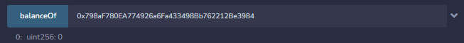

# La guerre des boutons

## Description

Disclaimer : Vous ne devez, en aucun cas, utiliser vos fonds personnels pour résoudre les challenges de web3. Il n'est pas nécessaire de posséder des cryptomonnaies pour lancer les challenges, intéragir avec ou les valider. (Il est aussi inutile de soudoyer les concepteurs des challenges) Cordialement -La trésorerie
Dans le café littéraire, l'atmosphère est empreinte de calme et de sérénité. Les étagères regorgent de livres, de revues et de magazines, tandis que les clients s'installent confortablement dans des fauteuils moelleux pour savourer leurs boissons chaudes et leurs lectures.

La quiétude ambiante est interrompue par l'arrivée de Lebrac. Il se tient là, seul dans un coin, le visage sombre et le regard perdu dans le vide. Vous décidez de vous approcher de lui pour voir s'il a besoin d'aide et c'est alors que vous remarquez qu'il tient sa chemise fermement, comme pour cacher quelque chose. Votre curiosité piquée au vif, vous demandez à Lebrac ce qui se passe et il vous confie que tous ses boutons lui ont été volés par la bande rivale, les "Velrans". Mais il n'a pas l'intention de se laisser faire, au contraire, il est déterminé à récupérer tous ses boutons et à en prendre autant que possible à ses ennemis.

Il vous regarde avec détermination et vous demande si vous voulez bien l'aider dans cette mission périlleuse. Allez-vous relever le défi lancé par Lebrac et l'aider à récupérer ses boutons et à prendre sa revanche sur les Velrans ?

---

nc challenges.404ctf.fr 31565

## Solution

Ce challenge utilise des mécanismes similaires à celui de `La Folie du jeu descente aux enfers`. Si vous avez besoin de plus d'explication allez voir le Write-up suivant : <https://github.com/bgaro/WriteUps/tree/main/404CTF/web3/La%20Folie%20du%20jeu%20descente%20aux%20enfers>.

Nous récupérons donc le contrat `Buttons.sol` et le chargeons sur Remix. Le code est assez long, voici un résumé des fonctions importantes :

- Pour valider le challenge, il faut que notre solde soit supérieur ou égal à 5 ethers (Nous devons récupérer tous les boutons).
- Il y a un mécanisme appelé `allowance` qui est la capacité de transfert de fond d'un compte à un autre.
- Nous pouvons transférer de l'argent entre les comptes
- Nous pouvons "bruler" des boutons. (les détruire)

En inspectant le code, nous nous rendons compte que nous ne pouvons pas augmenter l'`allowance` des autres comptes vers nous. Nous ne pouvons qu'augmenter la notre envers les autres. Cependant, en inspectant la fonction `burnFrom`, on se rend compte d'une erreur d'implémentation :

```solidity
function burnFrom(address account, uint256 amount) public {
        uint256 currentAllowance = _allowances[_msgSender()][account];
        if (currentAllowance != type(uint256).max) {
            require(currentAllowance >= amount, "Allocation insuffisante");
            unchecked {
                _approve(account, _msgSender(), currentAllowance - amount);
            }
        }
        _burn(account, amount);
    }

function _approve(address owner, address spender, uint256 amount) internal {
        require(
            owner != address(0),
            "Approbation depuis l'adresse nulle impossible"
        );
        require(
            spender != address(0),
            "Approbation vers l'adresse nulle impossible"
        );

        _allowances[owner][spender] = amount;
        emit Approval(owner, spender, amount);
    }
```

En effet, Nous nous rendons compte que la fonction `burnFrom` appelle la fonction `_approve` et augmente l'`allowance` du compte `account` vers le compte `msg.sender` (nous) du montant `CurrentAllowance - amount`. Le plan d'action est donc simple : Nous allons augmenter notre `allowance` envers le compte ciblé du montant détenu par ce dernier. Nous allons ensuite bruler 0 bouton afin que l'`allowance` de ce compte envers le notre soit égal à `CurrentAllowance`. Et nous allons finalement réalisé le transfert de fonds. Nous répétons cette opération jusqu'à ce que nous ayons récupéré tous les boutons.





## Flag : `404CTF{135_M4PP1N65_0N7_141r_51MP135_M415_C357_P45_70UJ0Ur5_13_C45}`
