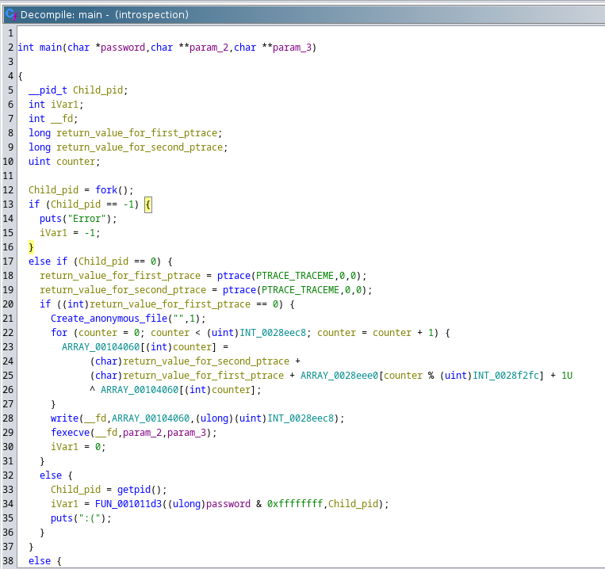
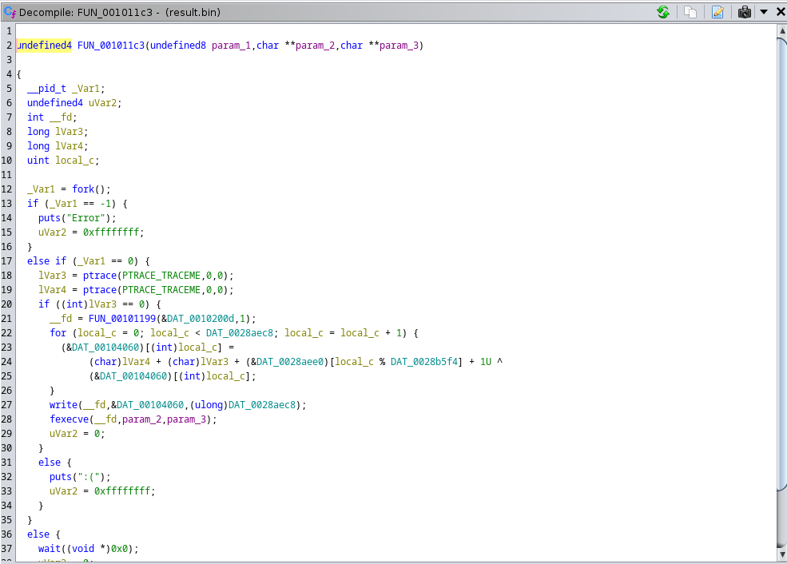
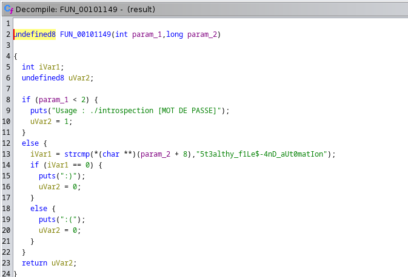

# Introspection

## Description

Cela fait un moment déjà que vous avez remarqué un personnage qui reste en retrait dans le café. Il s'agit d'une femme qui semble plongée dans ses pensées.

Vous décidez enfin de vous approcher.

« Bonjour, je me permet de vous déranger. Je n'ai pu m'empêcher de remarquer votre présence. Vous êtes soucieuse ? »

La femme lâche un long et franc soupir. Vous remarquez son nom écrit sur son mouchoir, Marceline Desbordes-Valmore.

Elle finit par retorquer :

« Savez vous vraiment qui vous êtes ? Ce qui est au fond de vous même ? Je crois qu'il est important de faire un effort pour se découvrir vraiment.
— Je ne sais pas, je ne crois pas avoir déjà fait un effort semblable.

— Et bien dans ce cas, j'ai une expérience à vous soummettre, afin que vous compreniez ce qu'il y au plus profond de votre subconscient, au délà des nombreuses couches qui vous séparent du monde matériel. »

---

Dans ce challenge vous devez trouver le mot de passe qui valide le crackme. L'exécution est un peu lente et peut donc faire bugger certain émulateurs de terminaux, vous pouvez par exemple rediriger stdout vers cat pour vous assurer d'avoir un output correct. Bonne introspection !

Format : 404CTF{password}

## Solution

Comme pour les autres challenges, nous récupérons le binaire fourni et l'analysons avec `ghidra`. On se rend compte qu'il s'agit d'un simple programme en `C` avec une fonction main.

Le programme initial va donc `fork` puis va empêcher d'éventuels debug à l'aide de `gdb` en appelant la fonction `ptrace`. Il est possible de supprimer les appels à `ptrace` en modifiant les octets directement mais on va voir que cela n'est pas très utile. Le fils ainsi créé va réaliser une opération sur deux tableaux de données avant d'exécuter le résultat de l'opération avec `fexecve`. Afin de comprendre le résultat de l'opération, nous pouvons la réimplémenter en python. Ceci nous donne un nouveau fichier binaire que nous analysons de nouveau sur `ghidra`.

On se rend compte qu'il s'agit du même programme que le précédent. On comprend donc mieux le nom du challenge `introspection`. Il va donc falloir automatiser cette introspection. Pour se faire, j'ai analysé la façon dont les tableaux de données étaient stockés dans le programme. On se rend compte avec plusieurs échantillons qu'ils sont toujours stockés de la même manière : d'abord la taille du tableau puis les données. On peut donc facilement les récupérer avec un script python. Le script `solve.py` permet de réaliser cela. Son fonctionnement est le suivant : Nous repérons les 4 octets `\x47\x43\x43\x3a` qui correspondent à `GCC:`. Ceci nous permet d'arriver directement à l'emplacement du premier tableau. Nous lisons donc la taille du premier tableau puis nous décalons l'offset jusqu'au dernier élèment de ce dernier (un padding peut survenir de temps en temps ce qui nous oblige à réaliser cela). L'ordre des tableaux étant toujours le même, nous appelons ce premier tableau `small_array`. Nous répétons cette opération pour le second tableau que nous appelons `big_array`. Nous décalons l'offset jusqu'au dernier octet représentant la taille de ce tableau, nous enlevons le padding du grand tableau puis nous récupérons ce dernier. Une fois les deux tableaux récupérés, nous réalisons l'opération du programme qui est toujours la même.

Nous implémentons ce procédé dans une boucle while qui s'arrête lorsque les 4 premiers octets sont différents du header `ELF`. Seul le premier programme est différent car il implémente un GIF rick roll. Une fois le dernier programme récupéré, nous l'analysons sur `ghidra` et récupérons le flag écrit en clair dans le programme.

## Flag : `404CTF{5t3althy_f1Le$-4nD_aUt0matIon}`
