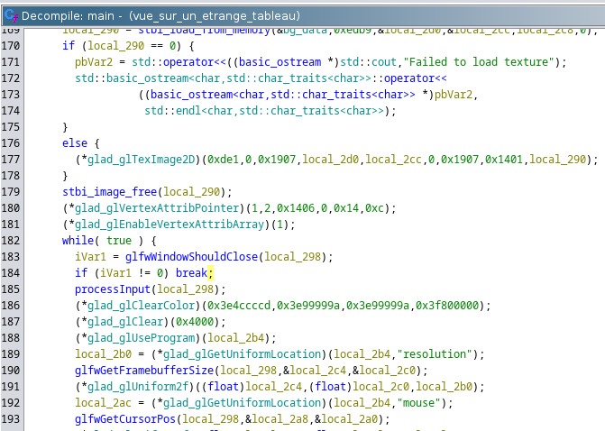
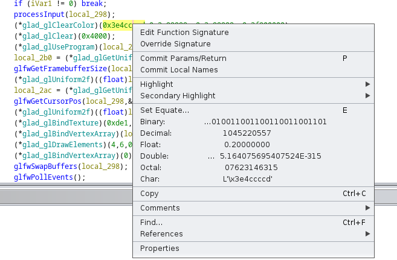

# L'Inspiration en images

## Description

Un quart d'heure plus tôt dans la soirée, vous étiez en train de parler avec Sabine de vos méthodes créatives, de vos exercices de style dans vos mediums respectifs. Elle mentionna au fil de la conversation son atelier de peinture se situant dans les combles rustiques du café littéraire, vous suggérant que vous pourriez toujours prendre de l'inspiration en observant ses peintures, son processus de création, sa manière de capturer la beauté insaisissable.

Une fois la conversation et le café terminés, vous vous aventurez dans l'atelier de peinture de Sabine, votre lampe torche à la main. Au milieu de cette mer de tableaux, vous repérez une peinture étrange, criblée d'inscriptions.

Et au pied du chevalet a chu une note, sur laquelle il est marqué : 'Ma clé est la couleur du fond de la toile'. Vous remarquez également d'autres inscriptions incompréhensibles au verso de la note. Sans doute un message chiffré ?

Vous vous mettez en quête de la clé.

---

Note : Le déchiffrage du message n'est pas nécessaire à la complétion du challenge.

Format : 404CTF{vec4(r,g,b,a)} où r,g,b et a sont des flottants précis au dixième.

## Solution

On récupère le binaire fourni et on l'analyse à l'aide de `ghidra`. On se rend compte que c'est un programme c++ qui utilise la librairie `glfw`.

En comparant chaque fonction avec la documentation disponible sur internet, on se rend compte que la fonction `glad_glClearColor` est la fonction qui nous intéresse car elle spécifie la couleur de fond de la fenêtre. Avec un simple clic droit sur chaque valeur, `ghidra` nous donne la conversion en `float`

On obtient donc les valeurs suivantes (arrondies au dixième) : `0.2,0.3,0.3,1.0`. Le flag est donc :

## Flag : `404CTF{vec4(0.2,0.3,0.3,1.0)}`
