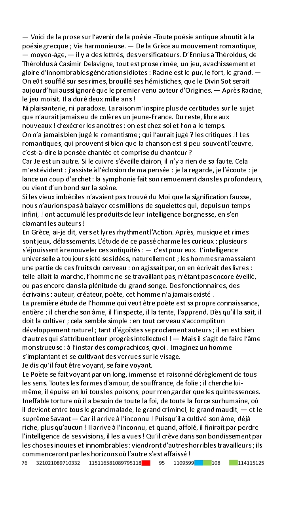

# Le Rouge et le vert, avec un soupçon de bleu

## Description

Ce qui semble être un brouillon a été laissé sur une table en hâte par un jeune homme. Vous vous rapprochez pour le lui rendre, mais il a déjà disparu. Vous décidez de lire ce bout de papier pour déterminer la personnalité de son auteur. Le début ressemble à un poème. La fin quant à elle a l'air assez spéciale...

--

Toutes les informations nécessaires à la résolution de ce challenge sont présentes dans l'énoncé ci-dessus. Déchiffrez la fin du poème.

## Solution

Nous obtenons une image sans caractéristique particulière. Cependant, un élément attire notre attention, des chiffres et des rectangles de couleurs en bas de l'image. Nous remarquons qu'il s'agit probablement de caractères ASCII car leur valeur est comprise entre 30 et 130. Les premiers caractères nous donne : `L flag`. Nous comprenons donc qu'il faut remplacer les couleurs par des caractères car le caractère espace est écrit.

- Dans un premier temps, nous remplaçons les rectangles de couleurs par des `x` et nous obtenons :

`Lx flag xst:la_vxx_xn_cxxlxxrs}`

- Nous remplaçons donc le rectangle blanc par 101 (l'encodage de `e`) :

`Le flag est:la_vxe_en_cxxlexrs}`

- Nous remplaçons le rectangle vert par 117 (l'encodage de `u`) :

`Le flag est:la_vxe_en_cxuleurs}`

- Nous remplaçons le rectangle bleu par 111 (l'encodage de `o`) :

`Le flag est:la_vxe_en_couleurs}`

- Nous remplaçons le rectangle rouge par 105 (l'encodage de `i`) :

`Le flag est:la_vie_en_couleurs}`

## Flag : `404CTF{la_vie_en_couleurs}`
