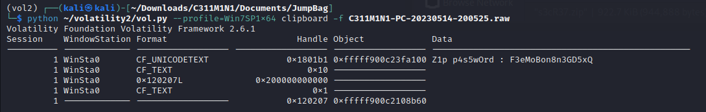
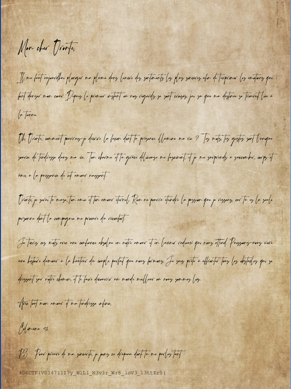

# Lettres volatiles

## Description

Une femme regarde avec hésitation une table à l'autre bout du café Le Procope, au milieu des conversations de fond des habitués. Sur cette table, un ordinateur allumé est laissé à l'abandon.

ARSINOÉ

à part

Vais-je réellement croissanter mon amie ?

Je m'en voudrais longtemps, même si c'est permis.

Cela suffit. Il est grand temps que je m'élance.

De Célimène, je vais trahir la confiance.

ARSINOÉ

prenant les commandes de la machine

Il semble que quelques intéressants fichiers

Soient protégés par quelque magie noire.

Célimène garde vraiment bien ses secrets.

Il va alors falloir capturer sa mémoire.

---

Arsinoé s'exécute en vitesse, et récupère le répertoire utilisateur de Célimène dans une clé. À vous d'y récupérer le secret.

MD5 C311M1N1.zip : a22df7724c02691d12ef1451fb83bf3a

## Solution

On télécharge le fichier fourni qui est un fichier zip. Ce fichier contient une capture d'un ordinateur Windows. On reconnait l'arborescence avec les `Documents`, `Downloads` etc... En inspectant le dossier `Downloads`, on trouve un fichier `s3cR37.zip` qui nous fait penser au mot `secret`. En essayant de l'ouvrir, on se rend compte qu'il est protégé par un mot de passe. Nous allons donc devoir probablement trouver le mot de passe.

En inspectant le dossier `Documents`, on se rend compte qu'il y a un fichier `raw`. En l'inspectant avec volatility, on ne trouve rien d'intéressant dans les processus ouverts ou dans les commandes tapées. Mais en regardant dans le presse papier, on voit que le mot de passe est présent.

On peut donc ouvrir le fichier `s3cR37.zip` et on obtient le flag.

## Flag : `404CTF{V0147i1I7y_W1Ll_N3v3r_Wr8_loV3_l3ttEr5}`
