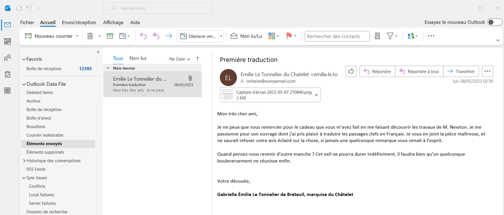

# Note de bas de page

## Description

En tendant l'oreille dans le salon, votre attention est captée par une conversation particulière. Là où les alentours dissertent sur des sujets de procédés littéraires toujours plus avancés, celle-ci semble en effet plutôt porter sur la philosophie naturelle. Vous vous approchez par curiosité, lorsque la marquise du Châtelet, alors en pleine explication des travaux d'un certain Leibniz, s’interrompt et vous interpelle :

« Vous me voyez ravie de vous rencontrer ici ! Nous n'avons pas eu la chance de nous rencontrer, mais on m'a parlé de vous et l'on m'a assuré que vous étiez formidable lorsqu'il s’agissait de retrouver les choses perdues. Voyez, j'ai travaillé il y a peu sur un projet qui me tient à cœur, et j'ai bien peur d'avoir perdu le fruit de mon travail par un triste accident. Heureusement, j'avais échangé à ce sujet avec un ami proche, et il est bien possible que notre correspondance ait gardé la trace d'une note de bas de page que je souhaiterais tout particulièrement retrouver. Auriez vous l’amabilité de m'assister dans ma mésaventure ? »

---

Aidez la marquise à retrouver la note qu'elle a perdue grâce à une sauvegarde de ses correspondances.

## Solution

Le fichier fourni est nommé `backup.pst`, en se renseignant un peu, nous nous rendons compte qu'il s'agit d'un fichier de sauvegarde de messagerie Outlook. Nous l'ouvrons donc dans Outlook :

En parcourant les dossiers, nous arrivons sur la boîte d'envoi avec un message contenant une pièce jointe. La pièce jointe est une image png et on peut apercevoir le début du flag en bas de l'image.

Ce fichier nous fait particulièrement penser à la CVE `acropalypse` de mars 2023. En inspectant en détail l'image, on se rend compte qu'elle possède deux `chunk` png `IEND`. L'image originale a été écrasée par le recadrage de l'image. En cherchant un peu, on trouve un script python permettant de récupérer l'image originale. Cependant, ce script n'est pas conçu pour les captures windows. Il faut donc modifier le script pour qu'il prenne en compte le cannal alpha de l'image. Le script solution se trouve dans `solve.py`. On se doute que l'image originale a une dimension de `1920*1080` et on peut donc retrouver le flag.

## Flag : `FAKEFLAG{FAKEFLAG}`
