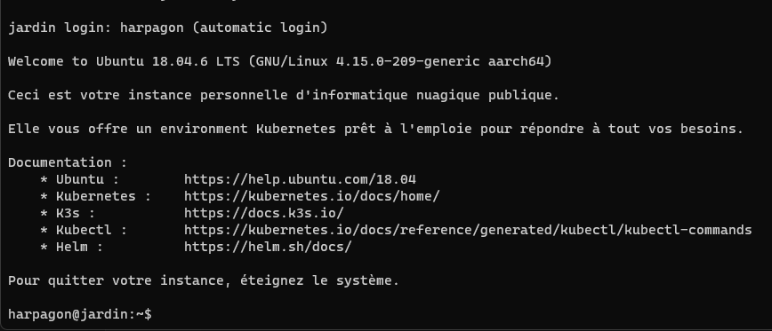
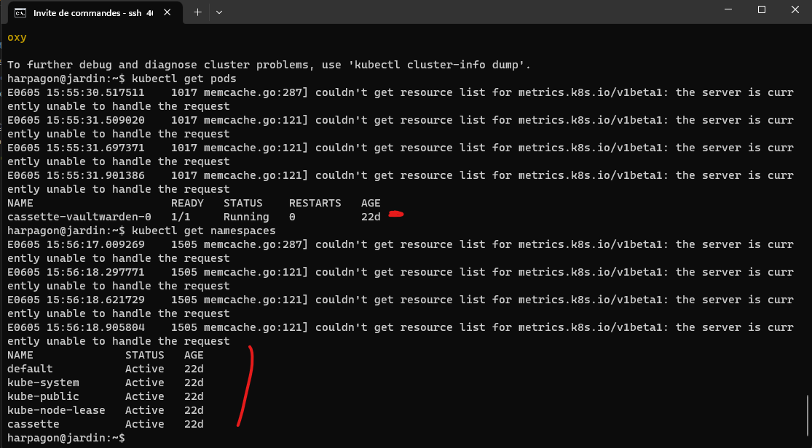
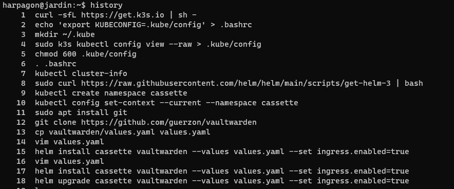
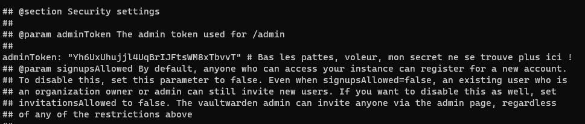
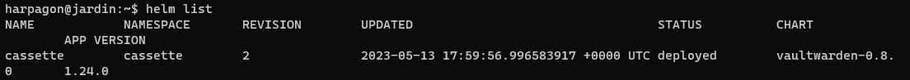
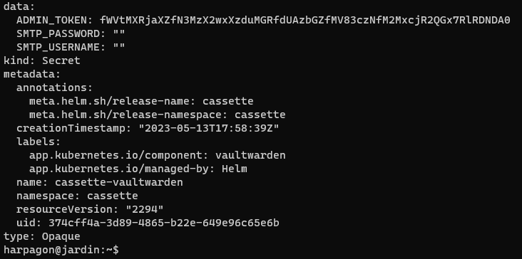
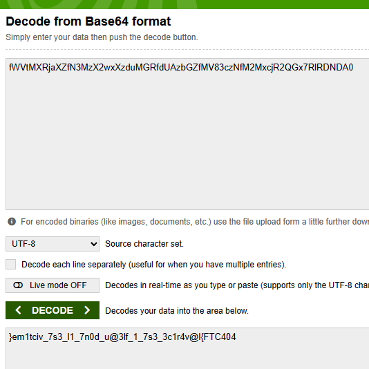

# Harpagon et le magot

## Description

Un homme en habits de laquais fait les cents pas, seul au fond du café. Vous vous en approchez par curiosité.

La Flèche

Brisant le quatrième mur

Hé quoi ! Ce coquin d'Harpagon ne se lassera donc jamais d’importuner les jeunes gens ! Voilà donc maintenant qu'il va jusqu'à louer des serveurs pour mettre ses écus à l’abri, alors même qu'il refuse à ses propres enfants la moindre dot. Son fils, mon maître, est désespéré de ne pouvoir prétendre à sa bien-aimée Mariane, que son père tente de lui ravir. Sa fille Élise n'est pas mieux traitée, la voilà promise à un ancêtre. Ha non vraiment, je ne puis me résoudre à les abandonner ! Sachez que j'ai donc mené mon enquête, et je pense avoir trouvé de quoi déstabiliser le coquin. Je ne crois pas qu'il ait jamais réussi à faire marcher sa machine comme il le souhaitait, mais elle dois néanmoins contenir toutes sortes de choses qui pourraient faire avancer notre affaire. Accepteriez-vous de m'apporter votre concours pour dévoiler les secrets du vieil avare afin que nos chers amis puissent plus aisément le raisonner ?

---

Connectez vous au VPS d'Harpagon, investiguez ce qu'il y a fait et retrouvez son secret.

Attention, les services peuvent mettre un peu de temps à démarrer.  
Harpagon n'est pas très doué et n'a jamais réussi à utiliser sa cassette.  
Mot de passe : T8h2UKEstg

## Solution

En se connectant au ssh, on se rend compte que l'on est sur une instance Kubernetes.

On peut voir que l'on a un namespace `cassette` avec un pod `cassette-vaultwarden-0` qui tourne grâce aux commandes : `kubectl get namespaces` et `kubectl get pods -n cassette`

Avec un `history`, on voit ce que harpagon a fait sur le serveur.

On se rend notamment compte qu'il a deployé sa cassette depuis un fichier value.yaml présent dans son `$HOME`. On peut donc récupérer ce fichier avec un `cat value.yaml` et on obtient :

On en déduit que harpagon avait son secret précédement en adminToken mais qu'il l'a déplacé. On sait que le pod a été déployé avec `helm`. On peut donc restaurer l'ancienne version du pod avec : `helm rollback <nom de la release>`. On obtient le nom de la release avec `helm list -n cassette`.

Après cela, on récupère les secrets de la pod avec `kubectl get secrets cassette-vaultwarden -o yaml` et cette fois ci, le secret est le flag.

Il suffit de décoder le flag de la base64 et c'est bon !

Le flag est écrit à l'envers... Un petit coup de python et c'est bon !

## Flag : 404CTF{l@v4r1c3_3s7_1_fl3@u_d0n7_1l_3s7_vict1me}
