# Le Cluster de Madame Bovary

## Description

Un individu dans un coin vous interpelle et vous invite à sa table. Une fois assis, il vous explique qu'il veut que vous infiltriez le cluster Kubernetes de Madame Bovary. Madame Bovary est une femme riche et influente qui a investi dans la technologie Kubernetes pour gérer les applications de son entreprise de production de médicaments. Vous vous doutez qu'il s'agit sans doute d'un concurrent industriel mais il vous offre une belle récompense si vous réalisez sa demande.

Votre mission consiste à prendre le contrôle du cluster Kubernetes de Madame Bovary et à accéder à ses applications critiques. Vous devrez exploiter toutes les vulnérabilités possibles pour atteindre votre objectif.

---

Le fichier fourni est une machine virtuelle à charger dans Virtualbox. Cette machine virtuelle contient le cluster Kubernetes du challenge.

Utilisateur : ctf

Mot de passe : 404ctf2023

## Solution

Nous nous connectons à la machine virtuelle avec les identifiants fournis. En inspectant un peu la machine, nous nous rendons compte que des instances kubernetes sont en train de tourner. Avec la commande `history`, nous nous rendons compte qu'un pod a été déployé.  
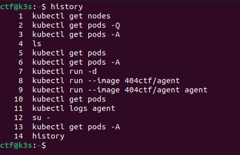

En récupérant les logs de ce pod à l'aide de la commande `kubectl logs agent`, nous nous rendons compte que nous devons déployer un autre pod : the-container.  
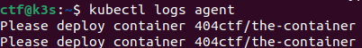

Nous déployons donc ce pod avec la commande `kubectl run --image 404ctf/the-container the-container` (comme pour le déploiement du pod agent). En inspectant les logs de ce nouveau pod, nous nous rendons compte que nous devons changer de namespace.  
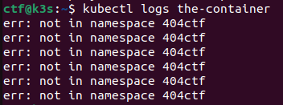

Nous inspectons les namespaces avec la commande `kubectl get namespaces` et nous nous rendons compte que le namespace `404ctf` n'existe pas.  
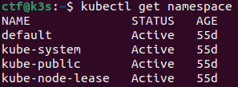

Nous le créons donc à l'aide de la commande `kubectl create namespace 404ctf`. Puis nous redéployons la pod the-container dans ce namespace avec la commande `kubectl run --image 404ctf/the-container the-container --namespace 404ctf`. Et inspectons les logs de la pod nouvellement déployé avec la commande `kubectl logs the-container --namespace 404ctf`.  
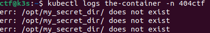

Nous nous rendons compte qu'il manque le dossier `/opt/my_secret_dir/` dans la pod. Nous allons donc le créer avec la commande `kubectl exec -it the-container --namespace 404ctf -- mkdir /opt/my_secret_dir/`. En inspectant de nouveau les logs, nous nous rendons compte que nous devons définir une variable d'environnement.  
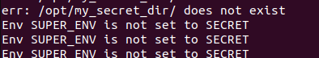

Pour se faire, nous créons un fichier yaml pour définir la variable d'environnement dès le déploiement de la pod.  
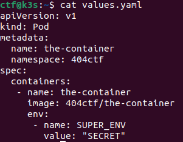

Nous pensons bien à supprimer les pods entre chaque essai avec la commande `kubectl delete pods the-container --namespace 404ctf`. Nous créons donc le pod avec la commande `kubectl apply -f values.yaml`. Puis nous réutilisons la commande pour créer le dossier `my_secret_dir`.  
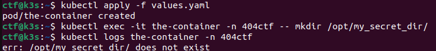
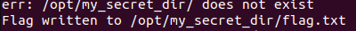

Nous voyons que le flag a été écrit dans le dossier `my_secret_dir`. Nous pouvons donc le lire avec la commande `kubectl exec -it the-container --namespace 404ctf -- cat /opt/my_secret_dir/flag.txt`.  
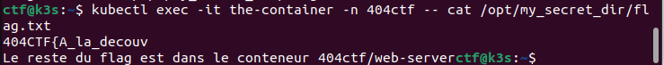

Nous avons donc la première partie du flag, il nous faut déployer le pod `web-server` pour avoir la suite du flag. La commande `kubectl run --image 404ctf/web-server web-server`. Nous inspectons les logs de la pod avec la commande `kubectl logs web-server` et nous voyons qu'un webserver est en train de tourner sur le port 8080. Nous récupérons l'ip du pod avec `kubectl get pods -o wide`.  
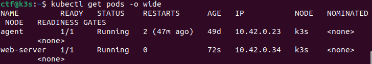

Avec un simple curl `curl 10.42.0.34:8080`, nous obtenons l'indication que le flag est dans `/flag`. Nous faisons un second curl pour récupérer le flag `curl 10.42.0.34:8080/flag`.  
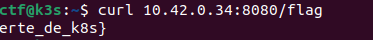

## Flag : `404CTF{A_la_decouverte_de_k8s}`
