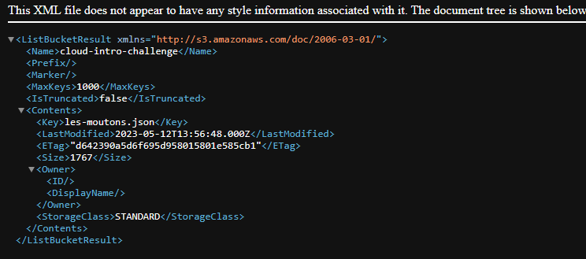

# Le Sot

## Description

Dans un coin reculé du café est assis Panurge, la mine sombre. Prenant pitié, vous vous donnez pour mission de lui remonter le moral.

« Que diable vous prend-il aujourd'hui ? Il me semblerait rencontrer le désepoir en personne.

— Mes moutons se sont échappés. L'un deux a pris la fuite, et les autres l'ont suivi.

— Comment ? Mais où donc sont-ils allés ?

— Ils sont partis dans les nuages... »

Allons, vous avez bon coeur n'est-ce pas ? Allez donc lui retrouver ses moutons.

---

Endpoint S3 : https://s3.gra.io.cloud.ovh.net/  
Bucket : cloud-intro-challenge  
Attention, il s'agit d'une vrai infrastructure cloud, le brute-force est particulièrement proscrit

## Solution

- On accède au Bucket : https://cloud-intro-challenge.s3.gra.io.cloud.ovh.net/
  
  On voit le fichier : les-moutons.json

- On accède donc au fichier : https://cloud-intro-challenge.s3.gra.io.cloud.ovh.net/les-moutons.json
  
  On voit que le fichier contient un tableau de plusieurs moutons avec le flag à la fin.

## Flag : 404CTF{D35_m0utOns_D4n5_13s_NU@g3s}
