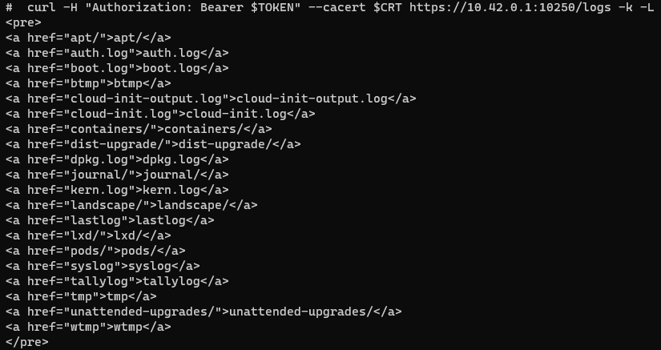
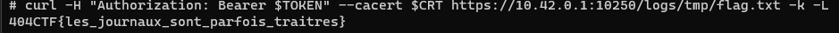

# Les nuages menaçants 3/3

## Description

Après avoir exploré tous les recoins du nuage, Proust s'exclame :

« Pouvez-vous en prendre le contrôle ? J'ai toujours voulu pouvoir diriger les nuages !

---

Connectez-vous au nuage avec le mot de passe suivant : 4GqWrNkNuN

Le challenge peut prendre quelques minutes à se lancer.

Le flag est dans /flag.txt sur l'hôte directement.

## Solution

Suite du challenge `Les nuages menaçants 2/3`. Nous venons de nous connecter au ssh grâce aux identifiants trouvés dans le challenge précédent. Nous cherchons ici à lire le flag qui se trouve dans `/flag.txt` sur l'hôte directement. Nous allons donc devoir trouver un moyen de sortir du container.

En inspectant le pod, nous nous rendons compte que le dossier `/var/log` de l'hôte est monté directement dans le container. De plus, nous voyons que nous avons les droits d'écriture sur ce dossier.  

En cherchant un peu sur le web, nous tombons sur divers articles expliquant la vulnérabilité. Il suffit de créer un lien symbolique vers la racine pour pouvoir ainsi lire tout le système de fichier. Problème, nous ne sommes pas root. Nous devons donc trouver un moyen de nous éléver en tant que root.

En analysant les binaires présents dans /bin, nous nous rendons compte que le binaire find a le bit suid d'activé ce qui nous permet de faire apparaître un shell root.  
  
Nous exécutons donc la commande suivante : `find . -exec /bin/sh -p \; -quit` et nous obtenons un shell root.  

Nous créons dons le lien symbolique vers la racine et nous pouvons lire le flag avec la commande après nous être positionné dans le dossier `/var/host/log` - `ln -s / tmp_link`

Reste à lire les logs pour trouver le flag. En testant l'ip `10.43.0.1` avec les identifiants trouvés sur la machine de proust, nous nous rendons compte que nous avons encore moins de permission que précédemment et surtout, nous ne pouvons pas lire les logs des pods. En inspectant un peu le réseau nous tombons sur la machine 10.42.0.1 qui a un port 10250 d'ouvert. Nous savons que le port 10250 correspond a une api kubelet et nous exécutons la commande `curl -H "Authorization: Bearer $TOKEN" --cacert $CRT https://10.42.0.1:10250/logs -k -L`  
  
Nous voyons tous les logs de la machine hôte ainsi que notre lien tmp, avec la commande `curl -H "Authorization: Bearer $TOKEN" --cacert $CRT https://10.42.0.1:10250/logs/tmp -k -L` nous obtenons la racine et donc le flag.  
  

## Flag : `404CTF{les_journaux_sont_parfois_traitres}`
