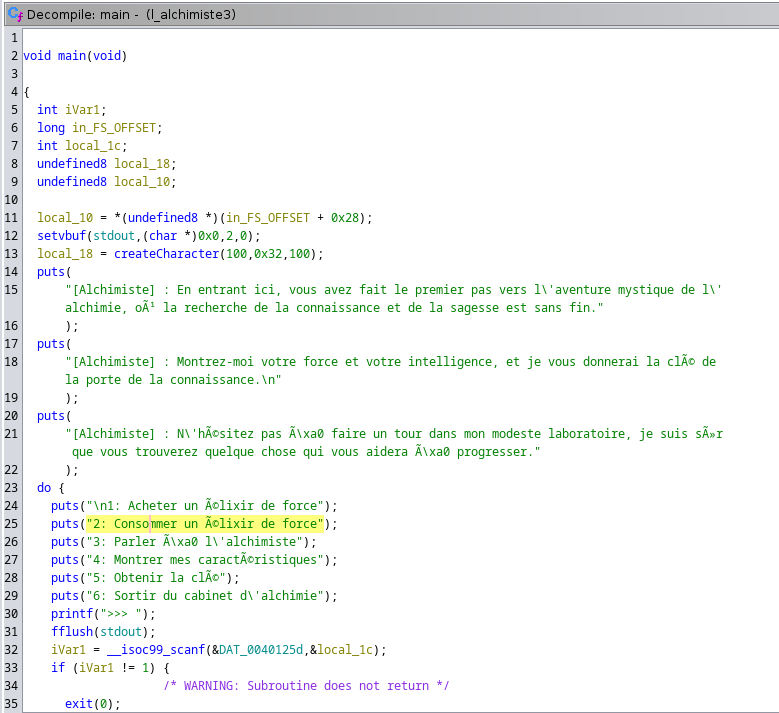
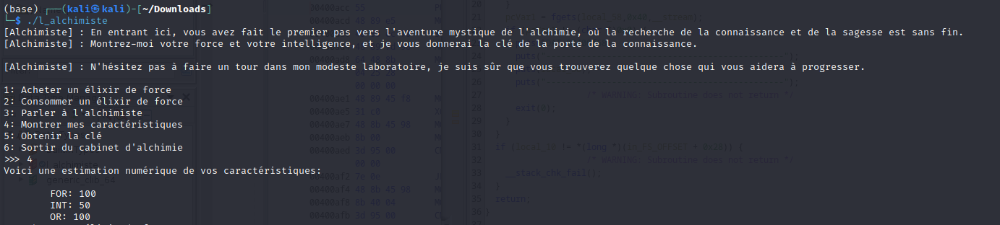

# Challenge

## Description

Alors que vous vous apprêtez à quitter le café littéraire, vous êtes attiré par une lumière étrange venant d'un coin de la pièce. Vous vous approchez et apercevez une pierre rougeoyante, posée sur un vieux manuscrit portant l'inscription 'Abraham le Juif'. Un homme étrange, vêtu d'une longue cape noire, est debout à côté de la pierre, les yeux fixés dessus.

Vous essayez de saluer l'homme, mais il ne semble pas vous remarquer. Vous lui demandez ce que cette pierre intriguante représente. L'homme lève enfin les yeux vers vous et répond d'une voix grave et rauque : « ma plus belle création, la pierre philosophale ». La pierre et l'aura mystique qui l'entoure vous fascinent.

L'homme se présente alors comme Nicolas Flamel, un célèbre alchimiste du XIVe siècle. Il engage la conversation avec vous et vous initie aux mystères de l'alchimie, vous expliquant la signification symbolique de la pierre philosophale et les pouvoirs qu'on lui prête.

Vous apprenez que Flamel a passé des années à la recherche de la pierre philosophale et qu'il a finalement réussi à la créer. Ses connaissances et son enthousiasme pour cette discipline mystique vous émerveillent.

Finalement, Flamel vous donne l'adresse d'un cabinet d'alchimie secret, connu seulement des initiés, où vous pourrez en apprendre davantage sur les secrets de l'alchimie. Vous le remerciez et quittez le café, le désir d'en savoir plus sur l'alchimie vous animant.

Vous avez maintenant la possibilité de vous rendre à ce fameux cabinet d'alchimie.

---

Toutes les informations nécéssaires à la résolution de ce challenge sont présentes après s'être connecté en netcat.

## Solution

On commence par analyser le binaire fourni avec `Ghidra`. (les chaînes de caractères sont bizarrement encodées car des caractère é,ù... sont utilisés)

On remarque une option `5: Obtenir la clé` qui appelle la fonction `view_flag`. Cependant, il faut que notre caractère ait une force ainsi qu'une intelligence de 150. En regardant les statistiques du personnage, on remarque que nous avons 100 de force et 50 d'intelligence. Il faut donc modifier ces valeurs.

Pour se faire, on voit que l'on a un marchand à notre disposition qui vend des potions de force à 50 pièces d'or. Lorsque nous achetons une potion, nous allouons un espace mémoire de 72 octets (ce qui correspond probablement à une structure de c), nous écrivons la chaîne `Elexir de Force` dans les 16 premiers octets. Puis nous écrivons l'adresse de la fonction `incStr` dans le dernier octet alloué.

Nous disposons également d'une fonction pour discuter avec le marchand. Cette fonction alloue un espace mémoire de 72 octets. Lorsque nous buvons cette potion, nous exécutons simplement la fonction contenue dans ce dernier octet. Mais il existe une vulnérabilité dans cette dernière, en effet il n'y a aucune vérification du buffer utilisé de plus, lors de l'utilisation d'une potion, l'espace mémoire de cette dernière est `free` mais le pointeur continue de pointer vers le haut du tas. Nous pouvons donc par la suite parler avec le marchand pour allouer un buffer en mémoire avec les informations que nous souhaitons puis nous pouvons boire la potion pour exécuter la fonction voulue.

Le plan d'action est donc simple, acheter une première potion afin d'initialiser les pointeurs, la boire, et utiliser le `use after free` pour augmenter notre force à 150, puis notre intelligence à 150 et enfin obtenir la clé. Nous pouvons obtenir l'adresse de la fonction `incInt` et `incStr` grâce au fichier ELF fourni. Le fichier `solve.py` permet de réaliser cela.

## Flag : `404CTF{P0UrQU01_P4Y3r_QU4ND_135_M075_5UFF153N7}`
