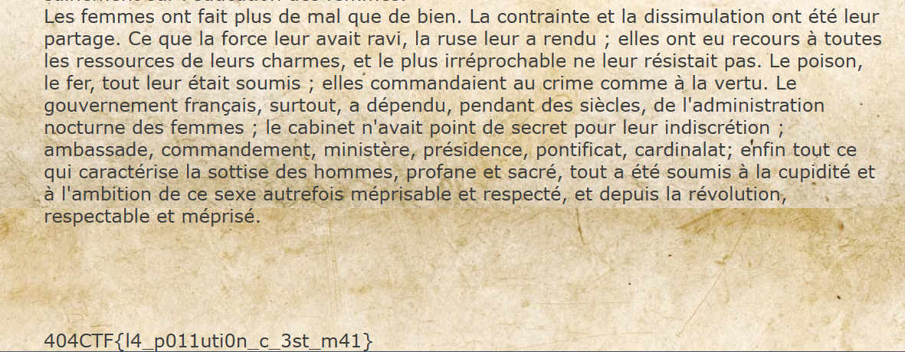

# Fuite en 1791

## Description

Alors qu'une douce odeur de café commençait à emplir Le Procope, une femme vient interrompre le calme de la chaleureuse pièce. Tout droit sortie du XVIIIème siècle, Olympe de Gouge fait irruption et se précipite vers votre table.

« Vous ! s’écria-t-elle

— Moi ? répondez-vous.

— Oui vous, allez porter cette lettre de toute urgence à Anne-Catherine Helvétius.

— Qui ? De quoi s'agit-il ?

— Je ne peux vous expliquer maintenant, mais le contenu de cette lettre peut changer le cours de l'histoire, ne perdez pas de temps. »

Et avant même que vous puissiez la questionner d'avantage, elle passa la porte et sortit du café.

Dans l'incompréhension la plus totale, vous commencez à parcourir ladite lettre…

---

Toutes les informations nécessaires à la résolution de ce challenge sont présentes dans l'énoncé ci-dessus.

https://ddfc.challenges.404ctf.fr

## Solution

En cliquant sur le lien, nous arrivons sur une page très simple avec un seul lien dessus :  

En cliquant sur le lien, nous arrivons sur une page avec indiqué Expired Link. En inspectant l'url (`https://ddfc.challenges.404ctf.fr/ddfc?expiry=-5625891076&signature=wawF6dC4Hz9g5NyCc3j1KCDcfztFE/sp`), nous nous rendons compte que deux paramètres GET sont passés : expiry et signature. En convertissant expiry en time stamp, nous voyons qu'il indique l'année 1791. Nous comprenons donc que nous devons modifier cela pour obtenir le flag. En modifiant expiry, la page affiche `Invalid signature`. Nous comprenons donc qu'il va falloir jouer avec expiry et signature pour obtenir le flag. Après quelques tests, nous nous rendons compte que chaque chiffre de expiry n'influe que sur une ou deux lettres de signature. De ce fait avec le script `web.py` nous pouvons brute force la signature et obtenir le flag. Exemple d'url solution : `https://ddfc.challenges.404ctf.fr/ddfc?expiry=+5000000000&signature=wawF6dC4Hz9g5NyCc371LiLZdzJEE/wv`

Une méthode beaucoup plus simple était de se rendre compte que signature ne prenait en compte que le début de l'url pour générer la signature. Il suffisait donc d'ajouter un troisième paramètre GET à l'url `expiry` qui écrasait le premier pour obtenir le flag. Exemple d'url solution : `https://ddfc.challenges.404ctf.fr/ddfc?expiry=-5625891076&signature=wawF6dC4Hz9g5NyCc3j1KCDcfztFE/sp&expiry=6000000000`  

## Flag : 404CTF{l4_p011uti0n_c_3st_m41}
