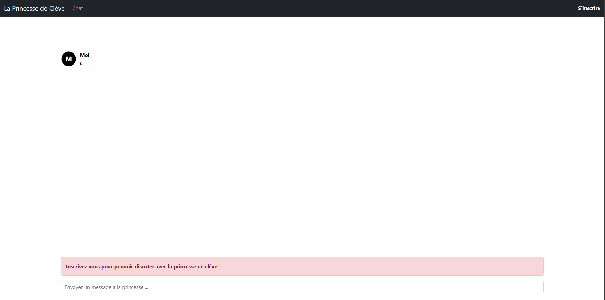
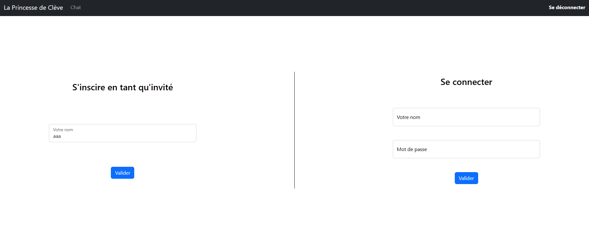

# L'Épistolaire moderne

## Description

Une femme frôle votre table et s'éloigne avec hâte. Les effluves de son parfum vous plongent brutalement dans votre passé, faisant remonter subitement de vieux souvenirs amoureux. Les émotions surgissent et un sentiment de nostalgie et de tristesse profonde s'empare de vous.

Vous décidez d'affronter cette douleur amoureuse et d'en parler à l'une des plus grandes figures du drâme de l'amour : la Princesse de Clève. Peut-être obtiendrez vous ses conseils et secrets.

---

Toutes les informations nécessaires à la résolution de ce challenge sont présentes dans l'énoncé ci-dessus.  
https://epistolaire.challenges.404ctf.fr/

## Solution

Nous arrivons sur une page avec un chat et un bouton s'inscrire. En essayant de communiquer on nous demande de nous inscrire.  

N'ayant pas d'identifiants, nous allons donc nous inscrire en tant qu'invité.  

En discutant quelques temps avec la princesse, nous nous rendons compte qu'elle ne répond que 2 phrases différentes. Nous allons donc essayer d'analyser le code source.  

En analysant le code source, nous voyons que les urls sont analysées pour en faire des liens cliquables. Nous allons donc essayer de mettre un lien vers une page de notre choix.  

Nous créons un request.bin afin d'intercepter la requête et de voir ce qu'il se passe.  
  

Nous nous rendons compte qu'un cookie est envoyé lors de la requête. En le comparant au notre, nous voyons qu'il est différent. Nous allons donc essayer de l'utiliser pour voir ce qu'il se passe. En l'utilisant, nous nous rendons compte qu'un nouveau bouton est apparu : Notes personnelles.  

En cliquant sur ce bouton, nous arrivons sur différentes notes et le flag :  

## Flag : FAKEFLAG{FAKEFLAG}
